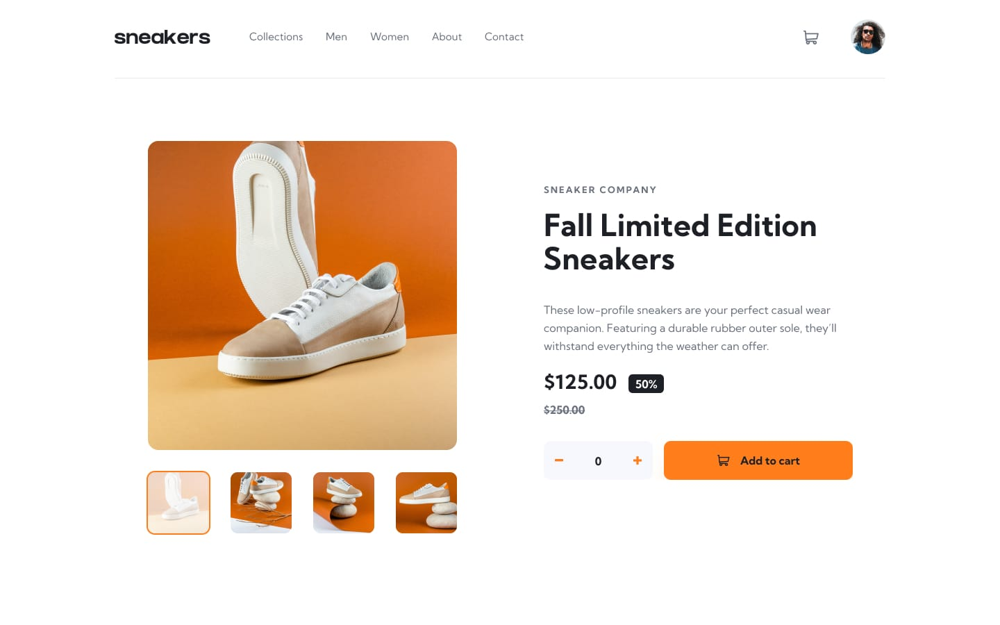

# Product Landing Page

Este repositório contém uma landing page desenvolvida para apresentar um produto de calçados de forma simples e direta. A página destaca os principais diferenciais do produto com foco em estética e clareza.



### Site em produção

👉 [Acesse a landing page aqui](https://)

### Dependências

- [NodeJS - 22.15.0](https://nodejs.org/en/download)

## Execuntando o projeto

#### 1 - clonando o repositório:

```bash
git clone https://github.com/NattanSilva/projeto-top-spec-int.git
```

#### 2 - navegue ate a pasta do projeto:

```bash
cd projeto-top-spec-int
```

#### 3 - instalando as dependências:

```bash
# usando npm
npm install
```

```bash
# usando yarn
yarn install
```

```bash
# usando phpm
pnpm install
```

#### 4 - execuntando o projeto:

```bash
npm run dev
```

#### 5 - abrindo o projeto no navegador:

Basta acessar <code>http://localhost:3000</code>.
